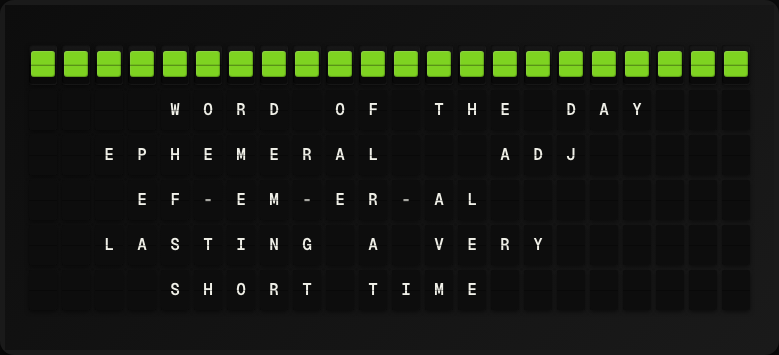

# Word of the Day Plugin

Display a word, its pronunciation, definition, and translations from the Free Dictionary API.



**→ [Setup Guide](./docs/SETUP.md)**

## Overview

The Word of the Day plugin fetches a word definition from dictionaryapi.dev and exposes translations in six languages. Because the API doesn't offer a daily-word endpoint, the plugin selects a word from a curated 365-word list, cycling one per day. No API key required.

## Template Variables

| Variable | Description | Example |
|---|---|---|
| `word_of_day.word` | The word | `ephemeral` |
| `word_of_day.part_of_speech` | Part of speech (noun, verb, etc.) | `adjective` |
| `word_of_day.definition` | Short definition | `lasting a short time` |
| `word_of_day.phonetic` | Phonetic spelling | `/ɪˈfem(ə)r(ə)l/` |
| `word_of_day.translation_es` | Spanish translation | `efimero` |
| `word_of_day.translation_it` | Italian translation | `effimero` |
| `word_of_day.translation_ja` | Japanese translation (romaji) | `hakanai` |
| `word_of_day.translation_de` | German translation | `fluechtig` |
| `word_of_day.translation_fr` | French translation | `ephemere` |
| `word_of_day.translation_la` | Latin translation | `caducus` |

## Example Templates

```
WORD OF THE DAY
{{word_of_day.word}}
{{word_of_day.phonetic}}
{{word_of_day.part_of_speech}}
{{word_of_day.definition}}

```

```
{{word_of_day.word}}
ES: {{word_of_day.translation_es}}
FR: {{word_of_day.translation_fr}}
DE: {{word_of_day.translation_de}}

```

## Configuration

| Setting | Name | Description | Required |
|---|---|---|---|
| `custom_word` | Custom Word | Leave blank to show a daily word from the built-in list, or enter a word to always show. | No |

## Features

- Free Dictionary API (no API key)
- 365-word curated list — one full year of daily rotation
- Translations in Spanish, Italian, Japanese (romaji), German, French, and Latin
- Custom word override
- Part of speech and phonetic

## Author

FiestaBoard Team
